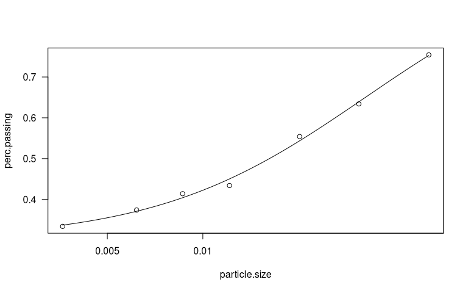

# Particle size estimation using the hydrometer method modified from ASTM D422-63(2007)e2 and Bouyoucos (1927)
Zacharias Steinmetz  
`r Sys.Date()`  


## Materials

### Equipment

* Balance
* Horizontal shaker
* 151H or 152H hydrometer
* 1 L volumetric cylinders for sedimentation
* 500 mL jars with a screw cap
* Squirt bottle
* Thermometer
* Parafilm

### Chemicals

* Sodium hexametaphosphate (SHMP)
* Deionized water

### Specimen

* Soil samples sieved to 2 mm

## Method

### Dispersing solution

Dissolve 40 g of SHMP in 1 L of deionized water. Use an ultrasonic bath
to ensure complete dissolution. The solution is stable for approximately
one month.

### Calibration

Hydrometers are graduated to be read at the bottom of the meniscus.
However, readings must be taken at the top of the meniscus in opaque
soil suspensions.

Lower the hydrometer into a 1 L cylinder filled with 125 mL of SHMP
solution and 875 mL of deionized water. When stabilized (after 20 s),
record both the reading at the bottom (zero or composite correction
factor) and at the top of the meniscus (meniscus correction factor).

### Sample pretreatment

If the soil sample contains primarily clay or silt, weigh out 50 g of
soil (accuracy  0.01 g) in a 500 mL screw bottle (in 3-fold
replication). If the sample is sandy, take 100 g each. Add 125 mL SHMP
to the soil. Agitate the mixture for 16 h in a horizontal shaker.

Completely transfer the soil solution into the sedimentation cylinder
using the squirt bottle. Fill up to the 1 L mark with deionized water.
Cap the cylinder with parafilm. Agitate the solution by turning the
cylinder upside down and back 30 times during 1 min.

### Measurement

Place the sedimentation cylinder at a bench where it can stand
undisturbed for the next 4 to 6 h.

Insert the hydrometer into the soil solution as soon as possible and
take the first reading the latest after 40 s at top of the meniscus.
Measure the temperature of the slurry. Repeat this measurement at 2, 5,
15, 30, 60, 120, 240, and 360 min. In any case, record the exact reading
time. The measurements may be reduced to an initial reading after 40 s
and a second one after 240 or 360 min (Ashworth et al., 2001). Rinse
the hydrometer after each measurement. If the ambient temperature
changes, recalibrate the hydrometer.

### Data recording

The following table may serve as a sample template to record the data

| Sample data | Time [min] | Hydrometer reading | Correction | Temperature [°C] |
| ----------- | ---------- | ------------------ | ---------- | ---------------- |
| S1          |  0.66      | 39                 | 2          | 23               |
| S1          |  2.00      | 33                 | 2          | 23               |
| S1          |  5.00      | 29                 | 2          | 23               |
| S1          | 15.00      | 23                 | 2          | 23               |
| S1          | 30.00      | 22                 | 2          | 23               |
| S1          | 60.00      | 20                 | 2          | 23               |
| S1          | ...        | ...                | ...        | ...              |
| S2          | ...        | ...                | ...        | ...              |

### Data evaluation

A complete description of how to calculate the particle size
distribution from the recorded hydrometer readings is available in the
respective ASTM guideline (ASTM D422-63(2007)e2, 2007). The
algorithm has also been implemented into this package using the `texture()` function:


```r
# Install envalysis
#if (!'devtools' %in% installed.packages()[,'Package']) install.packages('devtools')
#devtools::install_github('zsteinmetz/envalysis')
require(envalysis)

# Load and look at sample data
data(clayloam)
clayloam
```

```
# >     Time Temperature Reading Blank
# > 1   0.66          23      39     2
# > 2   2.00          23      33     2
# > 3   5.00          23      29     2
# > 4  15.00          23      23     2
# > 5  30.00          23      22     2
# > 6  60.00          23      20     2
# > 7 180.00          23      18     2
```

```r
# Calculate the particle size distribution
texture(Time, Reading, Blank, Temperature, data = clayloam, plot = T)
```



```
# > Soil particle estimation according to ASTM D422-63
# > Hydrometer model: 152H
# > Specific gravity (Gs) = 2.65   Soil extract: 50 g/L
# > 
# > Particle size distribution:
# >  Particle size Percent passing
# >        0.05155           0.754
# >        0.03102           0.634
# >        0.02019           0.554
# >        0.01214           0.434
# >        0.00864           0.414
# >        0.00618           0.374
# >        0.00361           0.334
# > 
# > Fitted with Log-logistic (log(ED50) as parameter) with upper limit at 1 (LL2.3u)
# > 
# > Soil texture classes (DIN 4022):
# >              Clay   Silt   Sand
# > Estimate   0.3177 0.4755 0.2068
# > Std. Error 0.0131 0.0242 0.0112
# > 
# > Soil texture classes (USDA):
# >              Clay   Silt    Sand
# > Estimate   0.3177 0.4287 0.25366
# > Std. Error 0.0131 0.0226 0.00954
```

## References
Ashworth, J., Keyes, D., Kirk, R., and Lessard, R. (2001). Standard
Procedure in the Hydrometer Method for Particle Size Analysis.
Communications in Soil Science and Plant Analysis, 32(5-6):633–642.

ASTM D422-63(2007)e2 (2007). Standard Test Method for Particle-
Size Analysis of Soils. Technical report, ASTM International, West
Conshohocken, PA.

Bouyoucos, G. J. (1927). The hydrometer as a new method for the
mechanical analysis of soils. Soil Science, 23(5):343–354.
