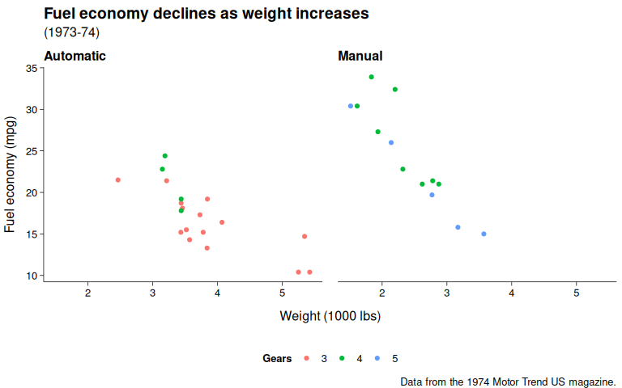
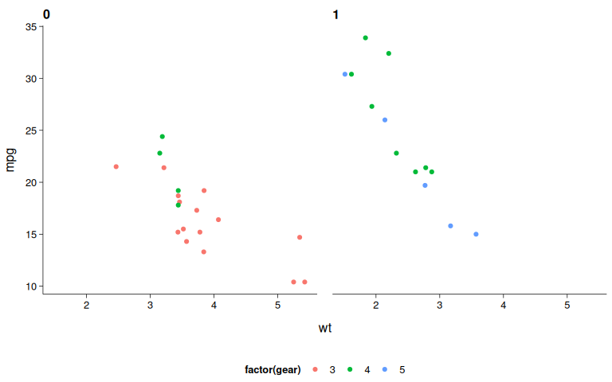

# theme_publish() demo
Zacharias Steinmetz  
`r Sys.Date()`  


## Sample code


```r
require(envalysis)
require(ggplot2)
p <- ggplot(mtcars) + geom_point(aes(x = wt, y = mpg,
     colour=factor(gear))) + facet_wrap( ~ am)
p
```



```r
p + theme_publish() + ggsave('theme_publish.png', dpi = 96)
```


